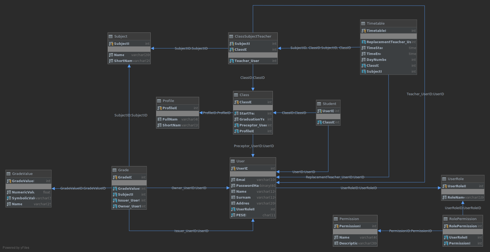

# Temat projektu
Tematem projektu jest aplikacja obsługująca szkołę podstawową


| Nazwisko i imię | Wydział | Kierunek | Semestr | Grupa | Rok akademicki |
| :-------------: | :-----: | :------: | :-----: | :---: | :------------: |
|  Maciej Adamus  | WIMiIP  |    IS    |    4    |   1   |   2019/2020    |

## Projekt bazy danych


Tabela user
```SQL
create table szkola.User
(
	UserID int auto_increment
		primary key,
	Email varchar(100) not null,
	PasswordHash binary(60) not null,
	Name varchar(120) null,
	Surname varchar(120) null,
	Address varchar(200) null,
	UserRoleID int not null,
	constraint User_UserRole_UserRoleID_fk
		foreign key (UserRoleID) references szkola.UserRole (UserRoleID)
)
comment 'Contains all users of the system';
```

## Implementacja zapytań SQL
Tutaj należy wylistować wszystkie funkcjonalności, wraz z odpowiednimi zapytaniami SQL. W tej sekcji należy zawrzeć wyłącznie zapytania z grupy DML oraz DQL.

## Aplikacja
Tutaj należy opisać aplikację, która wykorzystuje zapytania SQL z poprzedniego kroku. Można, jednak nie jest to konieczne, wrzucić tutaj istotne snippety z Waszych aplikacji.

## Dodatkowe uwagi
W tej sekcji możecie zawrzeć informacje, których nie jesteście w stanie przypisać do pozostałych. Mogą to być również jakieś komentarze, wolne uwagi, itp.
